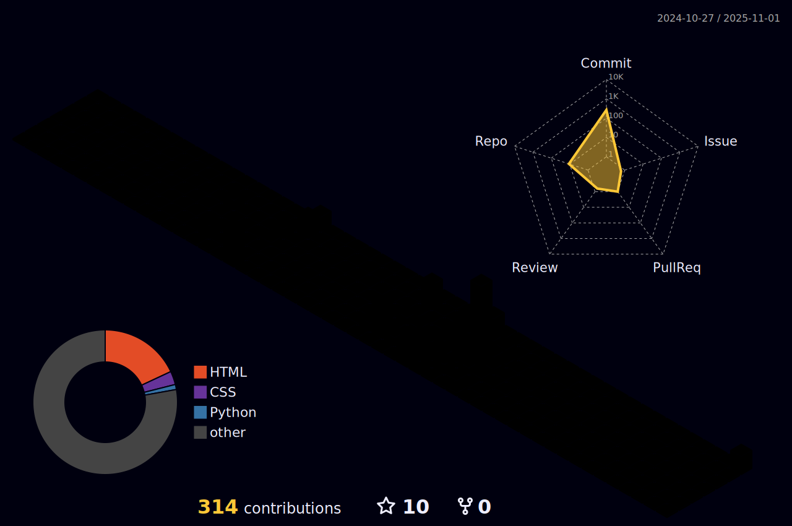

<!--
**Roseantic-Gudino/Roseantic-Gudino** is a ✨ _special_ ✨ repository because its `README.md` (this file) appears on your GitHub profile.

Here are some ideas to get you started:

- 🔭 I’m currently working on ...
- 🌱 I’m currently learning ...
- 👯 I’m looking to collaborate on ...
- 🤔 I’m looking for help with ...
- 💬 Ask me about ...
- 📫 How to reach me: ...
- 😄 Pronouns: ...
- ⚡ Fun fact: ...

-->

 
<!--

--->

<h1 align="center">
 &nbsp; 
</a> &nbsp; 

</h1>

<h3 align="center" style="font-family: Georgia, serif;">An aspiring software engineer from Bangalore, passionate about tech, innovation & continuous learning 📚🖋</h3>

 

  🌱 I’m passionate about problem-solving and learning new technologies ...
  
  🤔 I enjoy tackling real-world challenges with an analytical and data-driven approach ...
  
  💬 I love badminton 🏸, traveling ✈️, and exploring my creativity through art and calligraphy 🎨.
  
  ⚡ Fun fact: The “Hello, World!” program has been a tradition since 1972 ...
  
  📫 How to reach me: ...
 

 
  
   
  

  

 

<!--
<h2 align="center">⚒️ Languages-Frameworks-Tools ⚒️</h2>
 

    

-
 
-->

<h2 align="center">💻 Languages & Databases 💻</h2>
 

    

 

<h2 align="center">🚀 Frameworks 🚀</h2>
 

    

 

<h2 align="center">🛠 Tools & Environment 🛠</h2>
 

    

 

<!---

  <h2>🐍 My Contributions 🐍</h2>
   

  
     

--->

<h2 align="center">🌠 Github Stats 🌠</h2>
 

  
  
   
   
</a>

 

 

<!--

 
 <!--- https://github.com/Akshata-Gunapache/Akshata-Gunapache/blob/main/profile-3d-contrib/profile-night-rainbow.svg
--->

  
